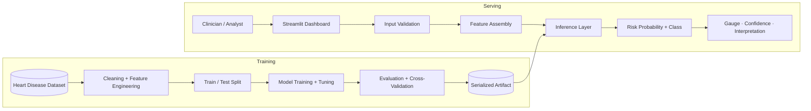

# Heart Disease AI

Production-grade cardiovascular risk prediction system built with Streamlit, XGBoost, and a reproducible Python ML workflow.

[Live Demo](https://heart-disease-clinical-ai.streamlit.app)


[](https://heart-disease-clinical-ai.streamlit.app)

---

A lightweight clinical decision-support system that estimates cardiovascular risk from structured patient indicators. Engineered with a clean separation between training and serving, deterministic preprocessing, a serialized model artifact, and an operator-friendly inference surface.

This repository is an engineering artifact — not a notebook experiment.

---

## Why this matters

Cardiovascular disease remains the leading cause of mortality worldwide. Risk stratification typically depends on the manual interpretation of structured indicators — age, blood pressure, cholesterol, resting ECG, exercise-induced angina, ST depression. This project demonstrates how a trained boosted classifier can be packaged into a maintainable, reproducible inference application that:

- Surfaces probabilistic risk rather than binary labels
- Operates within a controlled inference boundary
- Remains lightweight enough for low-cost deployment
- Provides a credible path to a hardened production service

The goal is not to replace clinical judgment. The goal is to demonstrate end-to-end ML systems thinking on a domain that demands rigor.

---

## Production engineering highlights

- **Inference boundary isolation** — the serving application loads a serialized model artifact and never executes training code paths.
- **Deterministic feature assembly** — UI inputs are mapped into a fixed-order numerical feature vector, matching the schema the model was trained on.
- **Probabilistic outputs** — `predict_proba` exposes calibrated risk magnitudes instead of opaque class labels.
- **Reproducible training pipeline** — dataset, notebook, and resulting model artifact are versioned together for full traceability.
- **Lightweight deployment shape** — a single Streamlit entrypoint, a pinned dependency set, and a Joblib-serialized model — no heavyweight runtime required.
- **Operator-grade UX** — risk gauge, confidence breakdown, and tiered medical interpretation surface model output in a form a non-engineer can reason about.
- **Architecturally extensible** — the inference path can migrate behind a FastAPI service, container, or managed endpoint without touching the training workflow.

---

## Architecture



Dataset → training → evaluation → serialized artifact → inference → user-facing decision surface. Each stage is independently inspectable and replaceable.

---

## System design decisions

**Why XGBoost.** Tabular clinical data with mixed feature types and modest sample sizes is a domain where gradient-boosted trees consistently outperform deeper alternatives. XGBoost provides strong baseline accuracy, fast inference, native handling of feature interactions, and a small serialized footprint.

**Why a serialized Joblib artifact.** A single immutable `.pkl` file is the simplest unit of model versioning. It is trivial to swap, hash, audit, and load from a controlled inference boundary — without recreating any training state.

**Why Streamlit for serving.** The inference path is interactive and low-throughput. Streamlit eliminates a frontend stack while keeping prediction logic in pure Python — the same module that would back a FastAPI handler in a future evolution.

**Why probabilistic outputs.** Clinical decision support is poorly served by binary labels. Surfacing `predict_proba` enables tiered interpretation (low / moderate / high) and gives the operator the information needed to act, escalate, or ignore.

**Why separation between training and serving.** Training is notebook-driven and exploratory; serving must be deterministic and side-effect free. Keeping `heart_disease_training.ipynb` and `app.py` mutually independent prevents training imports from leaking into the inference runtime.

**Why a fixed feature order in the UI.** The model was fit against a specific column ordering. Building the feature vector explicitly in `app.py` — rather than relying on a dict-to-DataFrame coercion — eliminates a class of silent schema drift bugs.

---

## ML pipeline

1. **Ingestion** — load `data/heart.csv` into a tabular workflow.
2. **Cleaning** — validate clinical columns and normalize types.
3. **Feature engineering** — preserve clinically meaningful predictors: chest pain type, cholesterol, resting BP, max heart rate, ST depression, major vessels.
4. **Splitting** — train/test partition to measure out-of-sample generalization.
5. **Training** — fit and compare multiple classifiers; promote the strongest boosted model.
6. **Tuning** — refine the boosted model and validate with cross-validation.
7. **Evaluation** — accuracy, comparative model performance, validation curves.
8. **Serialization** — persist the promoted model with Joblib for the serving runtime.

---

## Performance

| Model            | Accuracy   |
| ---------------- | ---------: |
| KNN              | 84.96%     |
| SVM              | 87.47%     |
| Voting Ensemble  | 86.35%     |
| Random Forest    | 88.02%     |
| Boosted Model    | **89.42%** |

Cross-validation, comparative accuracy, and boosted-model behavior are captured in:

- `Model accuracy.png`
- `boosted model accuracy.png`
- `cross validation .png`

---

## Tech stack

| Layer            | Technology                          |
| ---------------- | ----------------------------------- |
| Language         | Python 3.10+                        |
| Serving          | Streamlit                           |
| Model            | XGBoost (gradient-boosted ensemble) |
| Data             | Pandas · NumPy                      |
| Evaluation       | Scikit-learn                        |
| Visualization    | Plotly · Matplotlib                 |
| Serialization    | Joblib                              |

---

## Repository structure

```text
heart-disease-prediction/
├── app.py                        # Streamlit serving entrypoint
├── heart_disease_model.pkl       # Promoted, serialized model artifact
├── heart_disease_training.ipynb  # Reproducible training + evaluation notebook
├── data/
│   └── heart.csv                 # Source clinical dataset
├── result/
│   ├── Healthy patient/          # Sample inference snapshots
│   └── High risk patient/
├── assets/                       # UI / documentation assets
├── Model accuracy.png            # Comparative model evaluation
├── boosted model accuracy.png    # Promoted model evaluation
├── cross validation .png         # Cross-validation behavior
├── requirements.txt
├── LICENSE
└── README.md
```

---

## Getting started

```bash
git clone https://github.com/apoorvrajdev/heart-disease-ai.git
cd heart-disease-ai

python -m venv .venv
# Windows
.venv\Scripts\activate
# macOS / Linux
source .venv/bin/activate

pip install -r requirements.txt
streamlit run app.py
```

---

## Key engineering competencies demonstrated

- Applied machine learning on structured clinical data
- Gradient-boosted ensemble modeling and tuning
- Reproducible training pipelines with versioned artifacts
- Inference engineering and serving boundary design
- Probabilistic model output design for decision support
- ML systems organization (training vs. serving separation)
- Python packaging, dependency hygiene, and environment isolation
- Operator-facing UX for non-engineer model consumers
- Artifact management and model lifecycle awareness

---

## Scalability and future evolution

The current shape is deliberately small. The system was designed to evolve along well-defined seams:

- **Service migration** — lift the inference path into a FastAPI microservice; Streamlit becomes one of several clients.
- **Containerization** — package serving and dependencies into a reproducible Docker image.
- **Managed endpoints** — deploy behind a managed inference service (Cloud Run, ECS, Vertex AI, etc.).
- **Model optimization** — convert to ONNX for lower-latency CPU inference where appropriate.
- **Batch scoring** — add a scheduled pipeline for cohort-level scoring against tabular stores.
- **Explainability** — integrate SHAP for per-prediction feature attribution.
- **Observability** — emit structured prediction logs and track prediction drift, feature drift, and input quality.
- **Lifecycle** — add CI for linting, dependency validation, notebook execution, and an automated artifact promotion gate.
- **Governance** — audit logging and authentication for any clinical-adjacent deployment.

---

## License

Released under the [MIT License](LICENSE).

## Medical disclaimer

This project is for educational and engineering portfolio purposes only. It is not a medical device and must not be used as a substitute for professional medical advice, diagnosis, or treatment.
