# Heart Disease AI

> Production-oriented cardiovascular risk prediction dashboard built with Streamlit, XGBoost, and a reproducible Python ML workflow.

[Live Demo](https://heart-disease-clinical-ai.streamlit.app)


**Heart Disease AI** is a lightweight clinical decision-support prototype that estimates cardiovascular risk from structured patient indicators. The project emphasizes production-style ML engineering: deterministic preprocessing, serialized model inference, clear separation between training and serving concerns, and an operator-friendly Streamlit interface.

This repository is designed as an engineering artifact, not a notebook-only experiment.

## Overview

Cardiovascular disease risk assessment depends on multiple clinical variables, including age, blood pressure, cholesterol, resting ECG results, exercise-induced angina, and ST depression. This project turns those structured inputs into a usable prediction workflow with a trained boosted model and an interactive dashboard for rapid scenario analysis.

The goal is not to replace medical judgment. The goal is to demonstrate how a machine learning model can be packaged into a maintainable inference application with clear UX, reproducible training assets, and a path toward production hardening.

## System Architecture

```mermaid
flowchart LR
    U[User / Analyst] --> UI[Streamlit Dashboard]
    UI --> V[Input Validation]
    V --> FP[Feature Processing]
    FP --> INF[ML Inference Layer]
    INF --> XGB[XGBoost Prediction Engine]
    XGB --> OUT[Risk Probability + Class Label]
    OUT --> VIS[Gauge, Confidence Chart, Interpretation]

    D[(Heart Disease Dataset)] --> NB[Training Notebook]
    NB --> PREP[Cleaning + Feature Engineering]
    PREP --> SPLIT[Train / Test Split]
    SPLIT --> TRAIN[Model Training]
    TRAIN --> TUNE[Model Comparison + Tuning]
    TUNE --> EVAL[Metrics + Evaluation]
    EVAL --> SER[Serialized Model Artifact]
    SER --> INF
```



## Features

| Capability | Implementation |
| --- | --- |
| Real-time risk prediction | Streamlit form collects patient inputs and runs model inference on demand. |
| Probabilistic scoring | Uses `predict_proba` to surface risk probability rather than only a binary label. |
| Structured preprocessing | Converts UI inputs into the model's expected numerical feature vector. |
| Interactive dashboard | Presents risk metrics, gauge visualization, confidence split, and interpretation text. |
| Model serialization | Loads a trained model artifact from `heart_disease_model.pkl` using Joblib. |
| Reproducible experimentation | Includes the training notebook and source dataset used to produce the model artifact. |
| Evaluation assets | Stores model accuracy and cross-validation visualizations for review. |
| Lightweight deployment shape | Single-command Streamlit runtime with minimal infrastructure overhead. |

## Tech Stack

| Layer | Technology |
| --- | --- |
| Language | Python |
| App Framework | Streamlit |
| ML Model | XGBoost / boosted classifier workflow |
| Data Processing | Pandas, NumPy |
| Model Evaluation | Scikit-learn |
| Visualization | Plotly, Matplotlib |
| Serialization | Joblib |

## ML Pipeline

1. **Data ingestion**
   Load the heart disease dataset from `data/heart.csv` into a structured tabular workflow.

2. **Cleaning**
   Validate clinical feature columns, normalize expected data types, and prepare model-ready records.

3. **Feature engineering**
   Preserve clinically meaningful predictors such as chest pain type, cholesterol, resting blood pressure, maximum heart rate, ST depression, and number of major vessels.

4. **Train/test split**
   Separate training and validation data to measure generalization outside the fitting sample.

5. **Model training**
   Train and compare multiple classifiers, then promote the strongest boosted model for inference.

6. **Hyperparameter tuning**
   Evaluate boosted model behavior and cross-validation outputs to improve reliability.

7. **Evaluation**
   Review model accuracy, validation behavior, and classification performance before promoting the serialized artifact.

8. **Deployment workflow**
   Persist the trained model with Joblib, load it inside the Streamlit runtime, and expose predictions through a controlled inference interface.

## Performance Metrics

| Model | Accuracy |
| --- | ---: |
| KNN | 84.96% |
| Random Forest | 88.02% |
| SVM | 87.47% |
| Voting Ensemble | 86.35% |
| Boosted Model | **89.42%** |

| Metric | Value |
| --- | ---: |
| Accuracy | 89.42% |
| Precision | TBD |
| Recall | TBD |
| F1-score | TBD |
| ROC-AUC | TBD |

Additional validation assets are included in the repository:

- `Model accuracy.png`
- `boosted model accuracy.png`
- `cross validation .png`

## Repository Structure

```txt
heart-disease-ai/
├── app.py
├── data/
│   └── heart.csv
├── result/
│   ├── Healthy patient/
│   └── High risk patient/
├── assets/
│   └── .gitkeep
├── heart_disease_model.pkl
├── heart_disease_training.ipynb
├── Model accuracy.png
├── boosted model accuracy.png
├── cross validation .png
├── requirements.txt
├── LICENSE
└── README.md
```

## Setup & Installation

Clone the repository:

```bash
git clone https://github.com/apoorvrajdev/heart-disease-ai.git
cd heart-disease-ai
```

Create and activate a virtual environment:

```bash
python -m venv .venv
```

```bash
# Windows
.venv\Scripts\activate

# macOS / Linux
source .venv/bin/activate
```

Install dependencies:

```bash
pip install -r requirements.txt
```

Run the dashboard:

```bash
streamlit run app.py
```

## Engineering Highlights

- **Production-style inference boundary**: the dashboard loads a serialized model artifact and keeps prediction logic separate from training exploration.
- **Readable system design**: data, model, notebook, application, and result artifacts are easy to inspect during recruiter or engineering review.
- **Minimal operational footprint**: the application can be run locally with a small Python dependency set and a single Streamlit command.
- **Decision-support UX**: predictions include probability, confidence visualization, and concise interpretation instead of exposing raw model output alone.
- **Extensible architecture**: the current design can evolve into an API-backed service, containerized deployment, or monitored model endpoint without rewriting the core workflow.

## Future Improvements

- Containerize the application with Docker for reproducible deployment.
- Add CI checks for linting, dependency validation, and notebook execution.
- Publish a cloud-hosted inference endpoint behind a FastAPI service.
- Add SHAP-based explainability for feature-level risk interpretation.
- Introduce model monitoring for prediction drift and data quality checks.
- Add authentication and audit logging for controlled clinical review workflows.
- Store final model metrics in a versioned evaluation report.

## License

This project is released under the [MIT License](LICENSE).

## Medical Disclaimer

This project is for educational and engineering portfolio purposes only. It is not a medical device and should not be used as a substitute for professional medical advice, diagnosis, or treatment.
